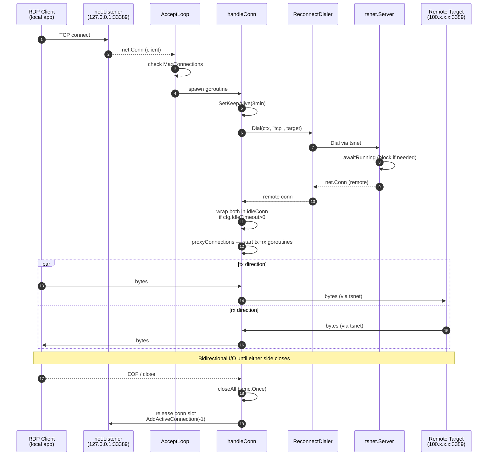
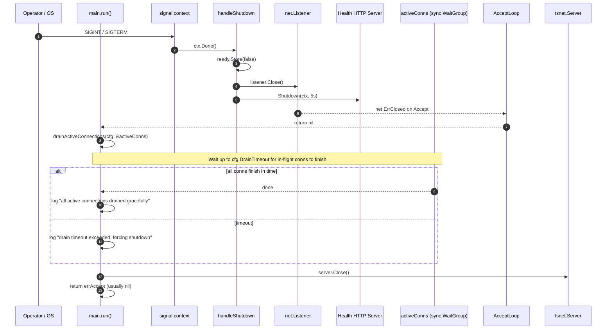
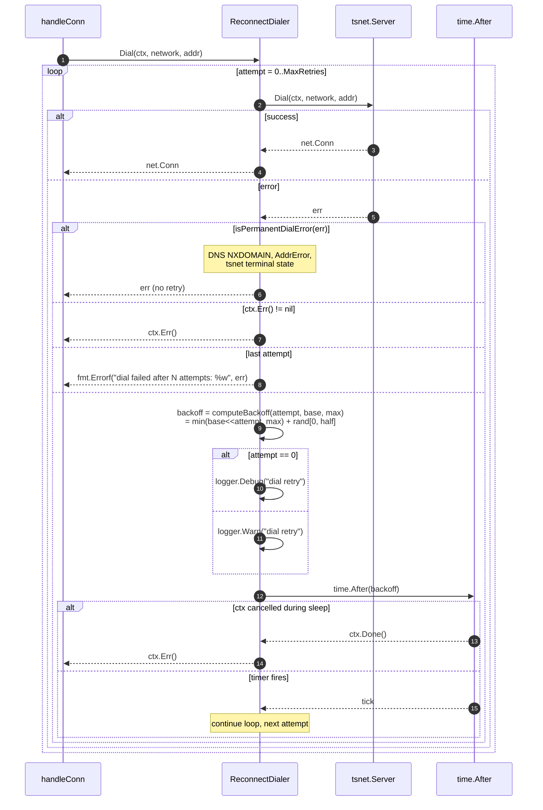

# Sequence Diagrams

> Mermaid sequence diagrams for the three runtime flows that matter most when onboarding contributors or debugging behavior: connection proxy, graceful shutdown, and dial-retry. Renders inline in Obsidian and on the Starlight docs site.

---

## 1. Connection proxy (happy path)

End-to-end from a local RDP client to the remote target through the tsnet tunnel.

**Highlights:**
- `AcceptLoop` is the only persistent goroutine waiting on the listener; `handleConn` spawns one goroutine per accepted conn plus a child for the rx direction in `proxyConnections`.
- `awaitRunning` is the implicit transient-recovery layer (see [adr-006-dialer-interface-extraction](https://github.com/mlorentedev/ts-bridge/blob/master/docs/adr/adr-006-dialer-interface-extraction.md) and the ARCH-004 spec).
- `idleConn` wrapping is invisible when `cfg.IdleTimeout == 0` (it returns the underlying conn unchanged).

---

## 2. Graceful shutdown + drain

What happens when the operator presses Ctrl-C or a SIGTERM arrives.

**Highlights:**
- The order matters: stop accepting (`listener.Close`) BEFORE draining, otherwise new conns keep arriving forever.
- `ready.Store(false)` flips the readiness probe immediately so an upstream load balancer (if any) stops sending traffic. Liveness stays true.
- `TS.Close()` is the LAST thing — only after all proxied I/O has drained or been forced shut, so we don't kill in-flight tunnels prematurely.
- In v1.5.1+, this same `TS.Close()` also runs on the error path of `initTailscale` to prevent the Windows file-lock leak (see [error-auth-failure](https://github.com/mlorentedev/ts-bridge/blob/master/docs/troubleshooting/error-auth-failure.md)).

---

## 3. Dial retry with exponential backoff (ARCH-004)

What ReconnectDialer does when the underlying tsnet dial fails transiently.

**Highlights:**
- The retry loop is **inside** `Dial()` — invisible to `handleConn`. From the proxy's perspective, a successful `Dial` either succeeded on the first attempt or after some hidden backoffs; `AddTotalConnection()` increments once per accepted conn, not per attempt.
- `isPermanentDialError` short-circuits to avoid retrying on hopeless cases (typo'd target hostname, terminal tsnet backend state, etc.). Conservative: anything unknown is treated as transient.
- The `select` on `ctx.Done()` vs `time.After(backoff)` is what makes context cancellation respond promptly even mid-sleep — verified by `TestReconnectDialer_ContextCancellationAbortsLoop`.

---

## Generating these diagrams

These are mermaid sequence diagrams (`sequenceDiagram`). They render natively in:
- Obsidian preview (`mermaid` plugin built-in since v0.12)
- GitHub markdown (since 2022)
- Starlight via `astro-mermaid` integration (already in `site/`)

To edit visually, paste a block into <https://mermaid.live/> and iterate.

## Related

- [adr-001-tsnet-userspace](https://github.com/mlorentedev/ts-bridge/blob/master/docs/adr/adr-001-tsnet-userspace.md) — why tsnet is the L3/L4 layer
- [adr-006-dialer-interface-extraction](https://github.com/mlorentedev/ts-bridge/blob/master/docs/adr/adr-006-dialer-interface-extraction.md) — the abstraction that makes ReconnectDialer plug-and-play
- [adr-007-multi-package-split](https://github.com/mlorentedev/ts-bridge/blob/master/docs/adr/adr-007-multi-package-split.md) — why these flows live in `internal/proxy/`
- `specs/archive/REL-003/` — idleConn wrapping in flow 1
- `specs/archive/ARCH-004/` — full design for flow 3
